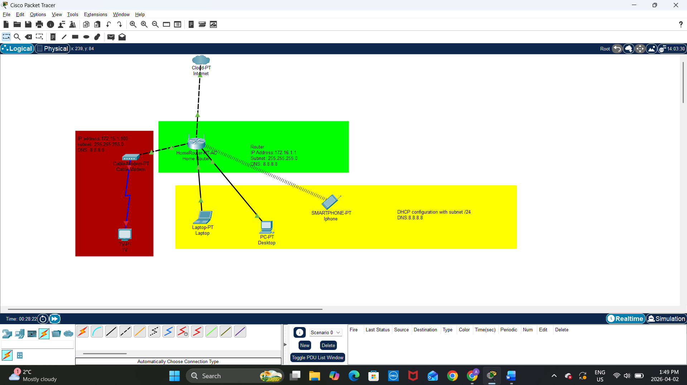

# 🏠 Home Network Documentation

## 📌 Overview
This document provides a detailed overview of my home network, including physical and logical topology, IP addressing scheme, network devices, configurations, and security practices.

---

## 🌐 Physical Topology

The physical topology represents how devices are physically connected.

### Devices:
- ISP Modem (provided by ISP)
- Wi-Fi Router (acts as gateway + DHCP server)
- Laptop (connected via Wi-Fi)
- Smartphone (Wi-Fi)
- Smart TV (Wi-Fi)
- Gaming Console (Ethernet)

---

## 🔗 Logical Topology

The logical topology shows how data flows in the network.

---

## 📍 IP Addressing Scheme

| Device            | IP Address      | Type        |
|------------------|-----------------|-------------|
| Router (Gateway) | 192.168.1.1     | Static      |
| Laptop           | 192.168.1.10    | DHCP        |
| Phone            | 192.168.1.11    | DHCP        |
| Smart TV         | 192.168.1.12    | DHCP        |
| Console          | 192.168.1.50    | Static      |

- Subnet Mask: 255.255.255.0
- DNS Server: 8.8.8.8 (Google DNS)
- DHCP Range: 192.168.1.10 – 192.168.1.100

---

## 🖥️ Network Devices & Services

### Devices:
- **Router**
  - Provides Wi-Fi connectivity
  - Acts as DHCP server
  - NAT enabled for internet access

- **Modem**
  - Connects home network to ISP

### Services:
- DHCP (Automatic IP assignment)
- NAT (Network Address Translation)
- Firewall (Basic router firewall enabled)
- DNS (Google DNS configured)

---

## ⚙️ Device Configurations

### Router Configuration:
- SSID: Home_Network
- Password: Strong WPA2/WPA3 password
- DHCP: Enabled
- Firewall: Enabled
- Remote Access: Disabled

### Console Configuration:
- Static IP assigned: 192.168.1.50
- Used for stable gaming connection

### Laptop & Mobile Devices:
- Automatically obtain IP (DHCP)
- Connected via secured Wi-Fi

---

## 🔐 Credential Security Method

To securely store login credentials, I use:

- A **password manager** (e.g., Bitwarden / LastPass)
- Strong, unique passwords for:
  - Router login
  - Wi-Fi network
- Two-Factor Authentication (2FA) enabled where possible

Additionally:
- Default router credentials were changed
- Passwords are not stored in plain text
- Backup of credentials stored securely

---

## 🔒 Security Measures

- WPA2/WPA3 encryption enabled
- Firewall active on router
- Regular firmware updates
- Guest network disabled
- MAC filtering (optional)

---

## 📝 Notes

- IP addresses have been modified slightly for privacy
- This network is designed for small home usage
- Future improvements may include VLANs and network segmentation

---

## 📊 Summary

This documentation provides a complete overview of a secure and functional home network, including topology, addressing, devices, and configurations.
